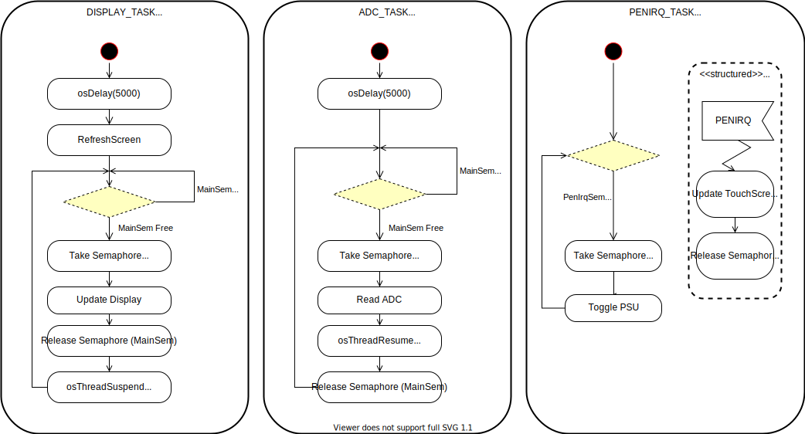

### HPECommonSlot BreakoutModule (SW)

Using Sempahores

#### <ins>Overview</ins>

EXTI is disabled during Touchscreen scan as this caused unexpected updates to the EXTI Pending register (EXTI_PR), which resulted in an infinite loop of interrupts and ISR calls. STM32F072 HW bug?

Below is the activity diagram for the three tasks.

DISPLAY_TASK and ADC_TASK share a semaphore to alternate their execution. No timer is used and their duration is entirely determined by the number of cycles they take to run their respective "Update Display" and "Read ADC" functions.

PENIRQ_TASK enables/disables the PSU power status. The task blocks itself using a single semaphore, which is released only when an interrupt is received from the touchscreen controller IC.

More information on the HW design can be found [here](https://github.com/cracked-machine/CommonSlotPSU_TouchScreenController_HW)

___

#### <ins>Pseudocode</ins>

###### System Definition:

  - Define tasks:
    - DisplayTask (Priority: Normal)
    - AdcTask     (Priority: Low)
    - PenIrqTask  (Priority: High)

  - Define binary semaphore IrqSem
  - Define binary semaphore MainSem

###### System Runtime:

  - DisplayTask:
      - Task (Infinite Loop):
        - Take MainSem (wait: 100ms)
        - Executes display code (use Touchscreen coordinates and ADC data)
        - Release MainSem
        - Suspend this task

  - AdcTask:
      - Task  (Infinite Loop):
        - Take MainSem (wait: 100ms)
        - Capture ADC data (global variable?)
        - Resume DisplayTask
        - Release MainSem

  - PenIrqTask:
    - ISR:
      - Update StateChart
      - Release IrqSem
    - Task (Infinite Loop):
      - Take IrqSem (wait: forever)
      - Toggle PSU output
      - Display touchscreen coordinates and ADC data

Using Event Queue (Not Implemented)

#### <ins>Pseudocode</ins>

###### System Definition:

 - Define tasks:
  - DisplayTask (Priority: High)
  - PenIrqTask  (Priority: Medium)
  - AdcTask     (Priority: Low)

 - Define Queues:
  - Event queue with 1 item (Register DisplayTask as receiver)

###### System Runtime:

- DisplayTask (state machine):

  - Task (Infinite Loop):
    - Wait for message on event queue (Suspended)
    - Process Event (Blocking):   
      - ADC Event:
        - update display with ADC data
      - TouchScreen Event:
        - update display with Touchscreen coordinates

- PenIrqTask:

  - ISR:
    - Resume PenIrqTask

  - Task (Infinite Loop):
    - capture data from Touchscreen IC over SPI (global variable?)
    - Send PENIRQ message on event queue
    - Suspend PenIrqTask

- AdcTask:

  - ISR:
    - Resume AdcTask

  - Task (Infinite Loop):
    - Capture data from data from ADC peripheral (global variable?)
    - Send ADC message on event queue
    - Suspend AdcTask

